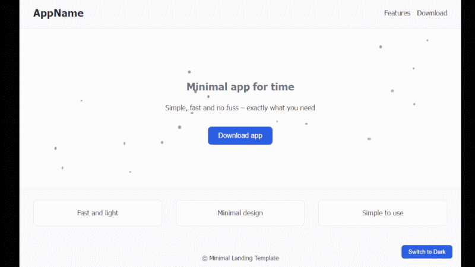

# Minimal Landing React Template

A **modern and minimal React landing page template** with light/dark theme toggle and subtle effects like animated particles in the Hero section.  
Fully responsive, works perfectly on **desktop, tablet, and mobile**.

Perfect for showcasing apps, digital products, or personal projects.

---

## Features

- Clean, minimalist design
- **Light and Dark theme** with toggle button
- Hero section with **animated particles** that change color with the theme
- Fully responsive layout for all screen sizes
- Ready-to-use components: `Header`, `Hero`, `Features`, `Footer`
- Easy deployment on **Netlify / Vercel / GitHub Pages**

---

## Demo

  
*Include a GIF or image showing the live landing page.*

---

## Installation

1. Clone the project:
```bash
git clone <REPO-URL>
cd <PROJECT-NAME>

2.Install dependencies
npm install

3.Start the development server:
npm run dev

4.Open in your browser: http://localhost:5173

Usage
All components are located in ./components/:
Header: Top navigation with links
Hero: Product introduction section with animated glowing particles
Features: Three feature boxes
Footer: Footer information
Theme Toggle
Theme can be switched using the bottom-right toggle button.
Particle colors automatically change with the theme (--particle-color variable).
Colors and styling are managed via CSS variables in styles.css.
Customization
Modify text, links, and colors in the components or styles.css.
Change the number, size, or animation speed of particles in Hero.jsx.
Layout is responsive and will adjust automatically on different screen sizes.

Project Structure
/src
  /components
    Header.jsx
    Hero.jsx
    Features.jsx
    Footer.jsx
  App.jsx
  main.jsx
  styles.css
README.md